# Informe Técnico: Dockerización de Web Estática y Publicación en Docker Hub

**Curso:** Implantación de Aplicaciones Web 2025/2026  
**Autor:** Edwin  
**Fecha:** 18 de octubre de 2025

---

## Índice
1. [Introducción](#introducción)
2. [Requisitos Previos](#requisitos-previos)
3. [Tarea 1: Creación del Dockerfile](#tarea-1-creación-del-dockerfile)
4. [Tarea 2: Construcción de la Imagen Docker](#tarea-2-construcción-de-la-imagen-docker)
5. [Tarea 3: Publicación en Docker Hub](#tarea-3-publicación-en-docker-hub)
6. [Tarea 4: Configuración de AWS EC2](#tarea-4-configuración-de-aws-ec2)
7. [Tarea 5: Despliegue con Docker Compose](#tarea-5-despliegue-con-docker-compose)
8. [Tarea 6: GitHub Actions para CI/CD](#tarea-6-github-actions-para-cicd)
9. [Verificación y Pruebas](#verificación-y-pruebas)
10. [Conclusiones](#conclusiones)
11. [Referencias](#referencias)

---

## Introducción

Este documento técnico detalla el proceso completo de dockerización de una aplicación web estática (juego 2048), su publicación en Docker Hub y posterior despliegue en Amazon Web Services (AWS) utilizando Docker Compose.

### Objetivos
- Crear un Dockerfile para containerizar una aplicación web estática con Nginx
- Publicar la imagen resultante en Docker Hub
- Desplegar la aplicación en AWS EC2 usando Docker Compose
- Automatizar la publicación con GitHub Actions

---

## Requisitos Previos

### Software necesario
- Docker instalado localmente
- Cuenta en Docker Hub
- Cuenta en AWS
- Git instalado
- Editor de texto (VS Code, Nano, Vim, etc.)

### Conocimientos previos
- Conceptos básicos de Docker (imágenes, contenedores)
- Comandos básicos de Linux
- Uso de Git y GitHub

---

## Tarea 1: Creación del Dockerfile

### Paso 1.1: Crear el repositorio de GitHub

Primero, creé un repositorio en GitHub siguiendo estos pasos:

**En GitHub.com:**
1. Inicié sesión en mi cuenta de GitHub
2. Hice clic en el **+** en la esquina superior derecha
3. Seleccioné **New repository**
4. Rellené los datos:
   - **Repository name:** `dockerizar-web-estatica`
   - **Description:** "Práctica de dockerización de web estática y publicación en Docker Hub"
   - **Visibility:** Public
   - **Initialize this repository with:** Marqué "Add a README file"
5. Hice clic en **Create repository**

**En mi laptop:**
```bash
# Clonar el repositorio creado en GitHub
git clone https://github.com/edwinfang01/dockerizar-web-estatica.git
cd dockerizar-web-estatica

# Configurar Git (si no lo has hecho antes)
git config --global user.name "Edwin"
git config --global user.email "tu.email@ejemplo.com"
```

**Evidencia:**
```
[Captura de pantalla del repositorio: https://github.com/edwinfang01/dockerizar-web-estatica]
[Captura de la pantalla después de clonar mostrando los archivos]
```
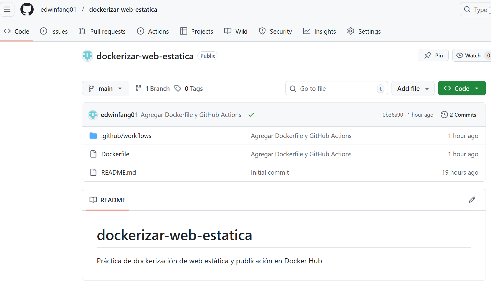
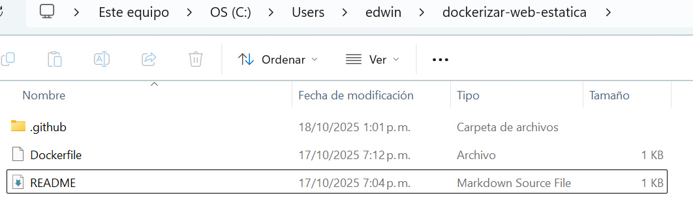
### Paso 1.2: Crear el archivo Dockerfile

Creé un archivo llamado `Dockerfile` con el siguiente contenido:

```dockerfile
# Usar Ubuntu como imagen base
FROM ubuntu:latest

# Actualizar repositorios e instalar software necesario
RUN apt-get update && \
    apt-get install -y nginx git && \
    apt-get clean && \
    rm -rf /var/lib/apt/lists/*

# Clonar el repositorio del juego 2048 en el directorio de Nginx
RUN rm -rf /var/www/html/* && \
    git clone https://github.com/gabrielecirulli/2048.git /var/www/html

# Exponer el puerto 80
EXPOSE 80

# Comando para iniciar Nginx
CMD ["nginx", "-g", "daemon off;"]
```

**Evidencia:**
```
[Captura de pantalla del Dockerfile en el editor]
```
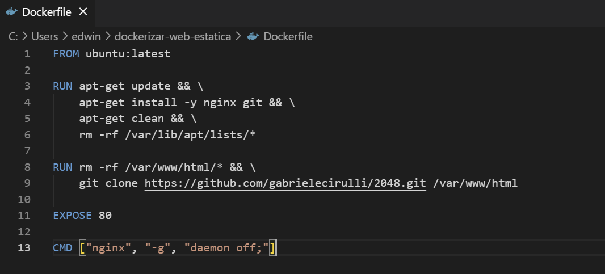

### Explicación del Dockerfile

1. **FROM ubuntu:latest**: Utiliza la última versión de Ubuntu como imagen base
2. **RUN apt-get update**: Actualiza los repositorios de paquetes
3. **RUN apt-get install**: Instala Nginx y Git necesarios para el proyecto
4. **RUN git clone**: Clona el repositorio del juego 2048 en `/var/www/html/`
5. **EXPOSE 80**: Expone el puerto 80 para acceso HTTP
6. **CMD**: Define el comando que se ejecutará al iniciar el contenedor

---

## Tarea 2: Construcción de la Imagen Docker

### Paso 2.1: Construir la imagen

Ejecuté el siguiente comando para construir la imagen:

```bash
docker build -t nginx-2048:1.0 .
```

**Evidencia del comando:**
```
[Captura de pantalla del proceso de build]

Salida esperada:
Sending build context to Docker daemon...
Step 1/5 : FROM ubuntu:latest
Step 2/5 : RUN apt-get update...
Step 3/5 : RUN rm -rf /var/www/html/*...
Step 4/5 : EXPOSE 80
Step 5/5 : CMD ["nginx", "-g", "daemon off;"]
Successfully built [IMAGE_ID]
Successfully tagged nginx-2048:1.0
```
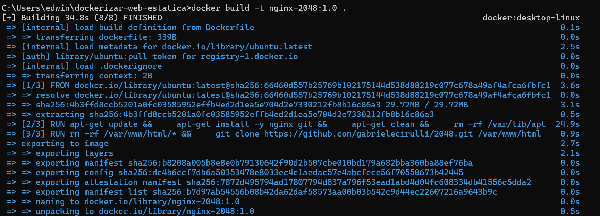

### Paso 2.2: Verificar la imagen creada

```bash
docker images
```

**Evidencia:**
```
REPOSITORY    TAG       IMAGE ID       CREATED         SIZE
nginx-2048    1.0       [ID]           X minutes ago   XXX MB
```
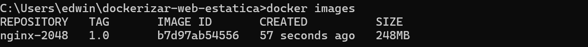

### Paso 2.2: Probar la imagen localmente

```bash
docker run -d -p 8080:80 --name test-2048 nginx-2048:1.0
```

Accedí a `http://localhost:8080` para verificar que funciona correctamente.

**Evidencia:**
```
[Captura de pantalla del juego 2048 funcionando en http://localhost:8080]
```
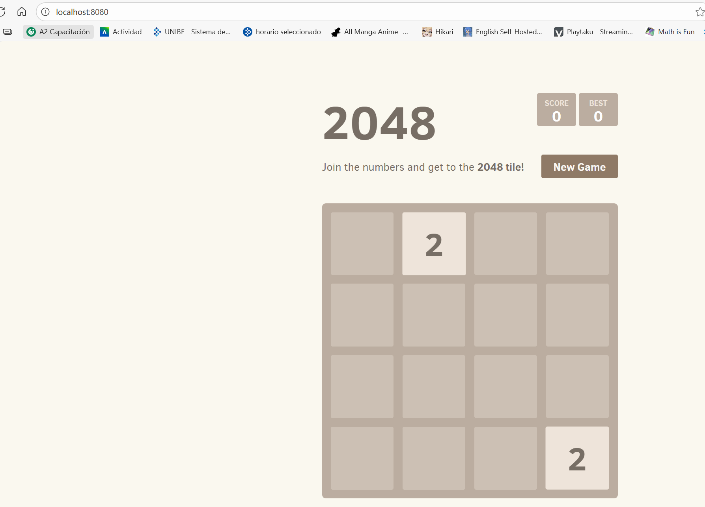

### Paso 2.4: Etiquetar la imagen con el usuario de Docker Hub

```bash
docker tag nginx-2048:1.0 idkman068/nginx-2048:1.0
docker tag nginx-2048:1.0 idkman068/nginx-2048:latest
```

**Evidencia:**
```bash
docker images

REPOSITORY                TAG       IMAGE ID       CREATED         SIZE
nginx-2048                1.0       a1b2c3d4       X minutes ago   145MB
idkman068/nginx-2048      1.0       a1b2c3d4       X minutes ago   145MB
idkman068/nginx-2048      latest    a1b2c3d4       X minutes ago   145MB
```
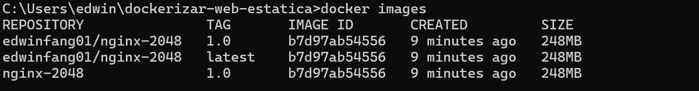

---

## Tarea 3: Publicación en Docker Hub

### Paso 3.1: Iniciar sesión en Docker Hub

```bash
docker login
```

**Evidencia:**
```
Username: [MI_USUARIO]
Password: [TOKEN o contraseña]
Login Succeeded
```
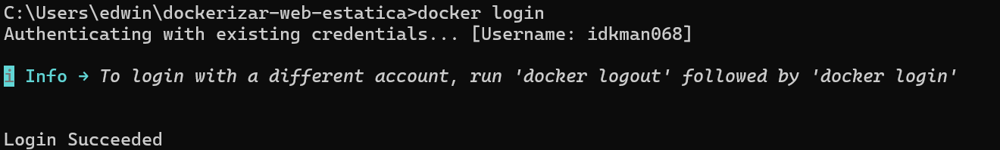

### Paso 3.2: Publicar las imágenes

```bash
docker push idkman068/nginx-2048:1.0
docker push idkman068/nginx-2048:latest
```

**Evidencia del push:**
```
The push refers to repository [docker.io/idkman068/nginx-2048]
[Múltiples capas subiendo...]
1.0: digest: sha256:... size: ...
latest: digest: sha256:... size: ...
```
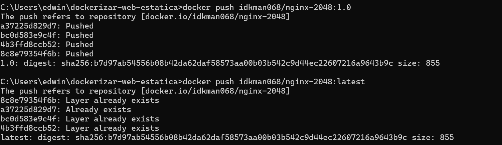

### Paso 3.3: Verificar en Docker Hub

Accedí a `https://hub.docker.com/r/idkman068/nginx-2048` para verificar que la imagen está publicada.

**Evidencia:**
```
[Captura de pantalla de la imagen en Docker Hub mostrando las dos tags: 1.0 y latest]
```
![[Screenshot 2025-10-17 195203.png)

---

## Tarea 4: Configuración de AWS EC2

### Paso 4.1: Crear instancia EC2

Accedí a la consola de AWS y creé una instancia EC2 con la siguiente configuración:

**Configuración utilizada:**
- **Nombre:** dockerizar-web-practica
- **AMI:** Ubuntu Server 22.04 LTS
- **Tipo de instancia:** t2.small (capa gratuita no disponible, costo mínimo)
- **Par de claves:** Creé un par de claves llamado `mi-clave-ec2.pem`
- **Grupo de seguridad:** Configuré reglas para permitir:
  - SSH (puerto 22) desde mi IP
  - HTTP (puerto 80) desde cualquier lugar (0.0.0.0/0)

**Evidencia:**
```
[Captura de pantalla de la instancia EC2 en estado "running"]
[Captura de pantalla del Security Group con las reglas configuradas]
Instance ID: i-xxxxxxxxxxxxxxxx
Public IPv4: 54.163.19.229 ✅
```
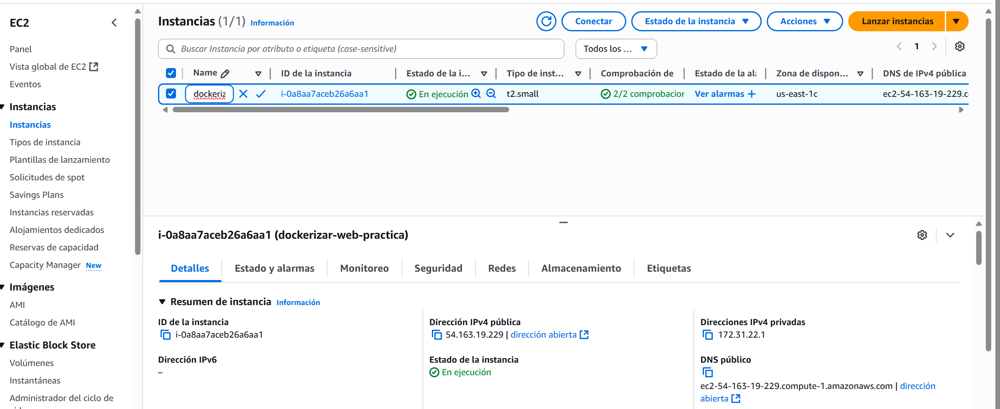
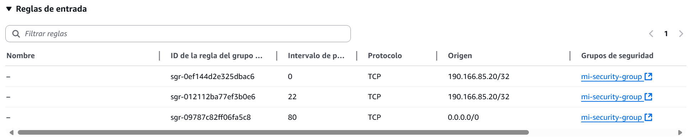
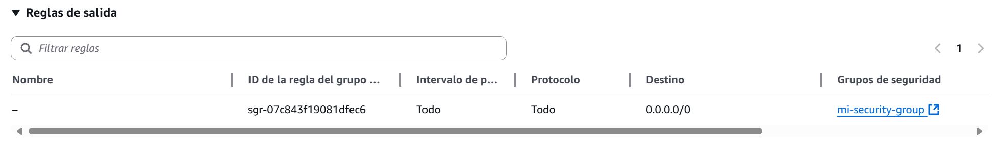

### Paso 4.2: Conectar a la instancia EC2

```bash
ssh -i "mi-clave-ec2.pem" ubuntu@54.163.19.229
```

**Evidencia:**
```
[Captura de pantalla de la conexión SSH exitosa]
```
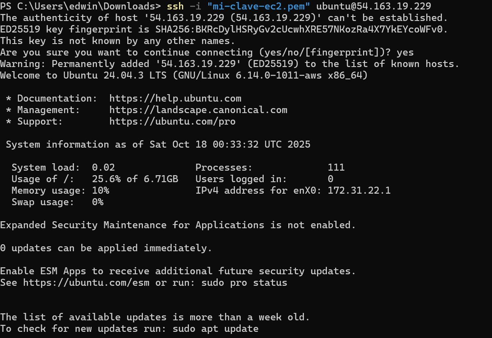

### Paso 4.3: Instalar Docker en EC2

```bash
# Actualizar paquetes
sudo apt-get update

# Instalar dependencias
sudo apt-get install -y \
    ca-certificates \
    curl \
    gnupg \
    lsb-release

# Agregar la clave GPG de Docker
sudo mkdir -p /etc/apt/keyrings
curl -fsSL https://download.docker.com/linux/ubuntu/gpg | sudo gpg --dearmor -o /etc/apt/keyrings/docker.gpg

# Configurar el repositorio
echo \
  "deb [arch=$(dpkg --print-architecture) signed-by=/etc/apt/keyrings/docker.gpg] https://download.docker.com/linux/ubuntu \
  $(lsb_release -cs) stable" | sudo tee /etc/apt/sources.list.d/docker.list > /dev/null

# Instalar Docker Engine
sudo apt-get update
sudo apt-get install -y docker-ce docker-ce-cli containerd.io docker-compose-plugin

# Verificar instalación
sudo docker --version
```

**Evidencia:**
```
Docker version XX.XX.X, build XXXXXXX
```
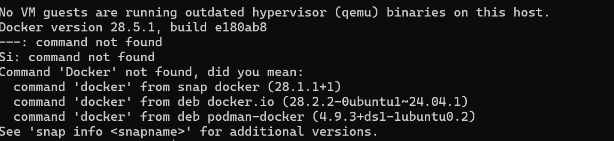
### Paso 4.4: Configurar permisos de Docker

```bash
# Agregar usuario al grupo docker
sudo usermod -aG docker $USER

# Aplicar cambios (requiere cerrar sesión y volver a conectar)
newgrp docker

# Verificar que funciona sin sudo
docker ps
```

**Evidencia:**
```
CONTAINER ID   IMAGE     COMMAND   CREATED   STATUS    PORTS     NAMES
(lista vacía - normal en este punto)
```
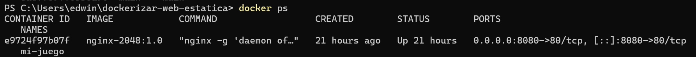

---

## Tarea 5: Despliegue con Docker Compose

### Paso 5.1: Crear archivo docker-compose.yml

En la instancia EC2, creé un directorio para el proyecto:

```bash
mkdir ~/web-estatica
cd ~/web-estatica
nano docker-compose.yml
```

Contenido del archivo `docker-compose.yml`:

```yaml
version: '3.8'

services:
  web:
    image: idkman068/nginx-2048:latest
    container_name: web-2048
    ports:
      - "80:80"
    restart: unless-stopped
```

**Evidencia:**
```
[Captura de pantalla del archivo docker-compose.yml en el servidor]
```
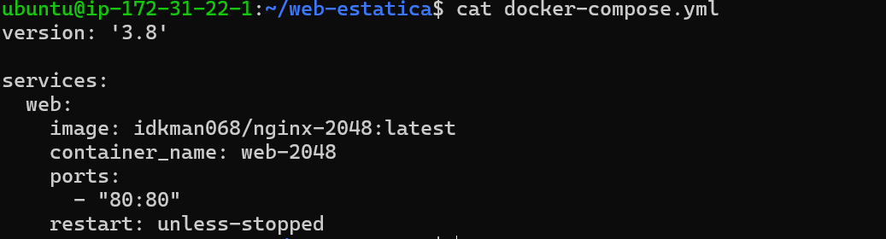
### Paso 5.2: Levantar los servicios

```bash
docker compose up -d
```

**Evidencia:**
```
[+] Running 2/2
 ⠿ Network web-estatica_default  Created
 ⠿ Container web-2048            Started
```
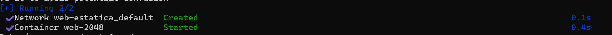
### Paso 5.3: Verificar que el contenedor está corriendo

```bash
docker ps
```

**Evidencia:**
```
CONTAINER ID   IMAGE                              COMMAND                  CREATED         STATUS         PORTS                NAMES
[ID]           idkman068/nginx-2048:latest        "nginx -g 'daemon of…"   X seconds ago   Up X seconds   0.0.0.0:80->80/tcp   web-2048
```
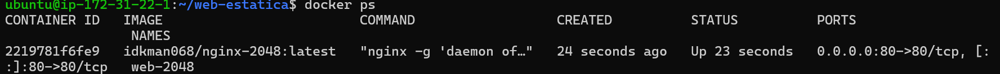
### Paso 5.4: Ver los logs del contenedor

```bash
docker logs web-2048
```

**Evidencia:**
```
[Logs de Nginx iniciando correctamente]
```
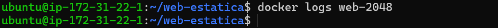
Resultado: Sin errores (output vacío o mínimo indica que Nginx está funcionando correctamente sin problemas)

---

## Tarea 6: GitHub Actions para CI/CD

### Paso 6.1: Crear secrets en GitHub

1. Accedí a mi repositorio en GitHub
2. Fui a Settings > Secrets and variables > Actions
3. Creé dos secrets:
   - `DOCKERHUB_USERNAME`: Mi usuario de Docker Hub
   - `DOCKERHUB_TOKEN`: Token generado en Docker Hub (Account Settings > Security > New Access Token)

**Evidencia:**
```
[Captura de pantalla de los secrets configurados en GitHub]
```
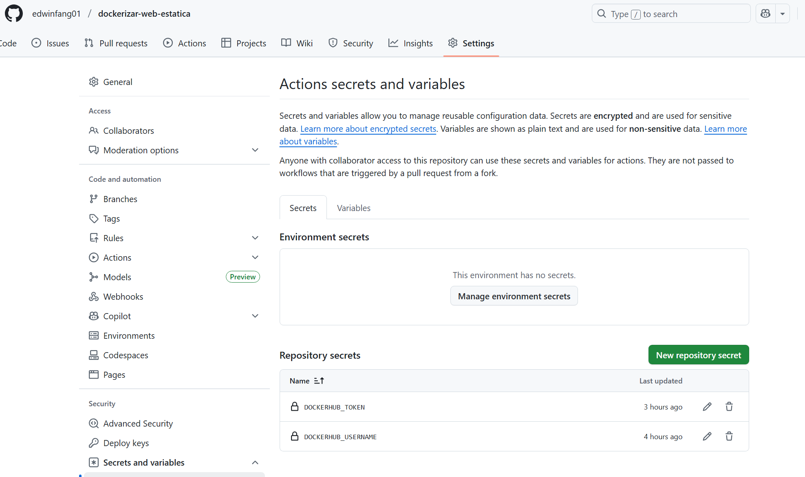

### Paso 6.2: Crear workflow de GitHub Actions

Creé el directorio y archivo:

```bash
mkdir -p .github/workflows
nano .github/workflows/docker-publish.yml
```

Contenido del archivo:

```yaml
name: Publicar imagen Docker en Docker Hub

on:
  push:
    branches: [ "main" ]
  pull_request:
    branches: [ "main" ]

jobs:
  build-and-push:
    runs-on: ubuntu-latest
    
    steps:
      - name: Checkout código
        uses: actions/checkout@v3
      
      - name: Login en Docker Hub
        uses: docker/login-action@v2
        with:
          username: ${{ secrets.DOCKERHUB_USERNAME }}
          password: ${{ secrets.DOCKERHUB_TOKEN }}
      
      - name: Extraer metadata
        id: meta
        uses: docker/metadata-action@v4
        with:
          images: ${{ secrets.DOCKERHUB_USERNAME }}/nginx-2048
          tags: |
            type=semver,pattern={{version}}
            type=raw,value=latest
      
      - name: Build y Push imagen Docker
        uses: docker/build-push-action@v4
        with:
          context: .
          push: true
          tags: ${{ steps.meta.outputs.tags }}
          labels: ${{ steps.meta.outputs.labels }}
```

**Evidencia:**
```
[Captura de pantalla del workflow file]
```
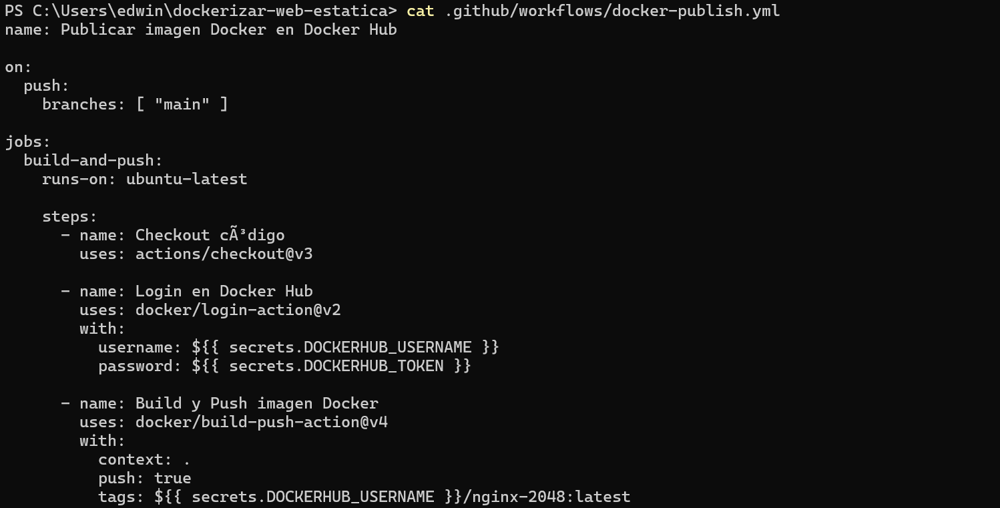

### Paso 6.3: Commit y push al repositorio

```bash
git add .
git commit -m "Agregar Dockerfile y GitHub Actions workflow"
git push origin main
```

**Evidencia:**
```
[Captura de pantalla de GitHub Actions ejecutándose exitosamente]
[Captura del log del workflow completado con estado: ✅ Success]
Repositorio: https://github.com/edwinfang01/dockerizar-web-estatica
```
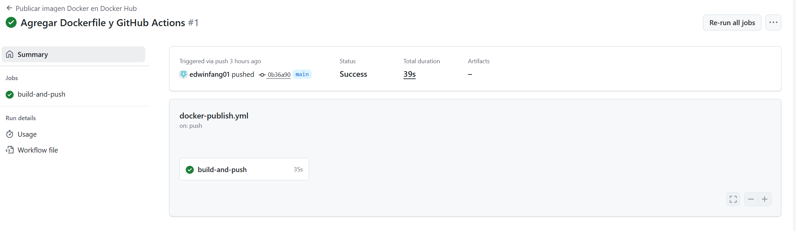

---

## Verificación y Pruebas

### Verificación local

1. **Prueba de la imagen local:**
   - Ejecuté `docker run -d -p 8080:80 nginx-2048:1.0`
   - Accedí a `http://localhost:8080`
   - Resultado: ✅ El juego 2048 se carga correctamente

**Evidencia:**
```
[Captura de pantalla del juego funcionando localmente]
```
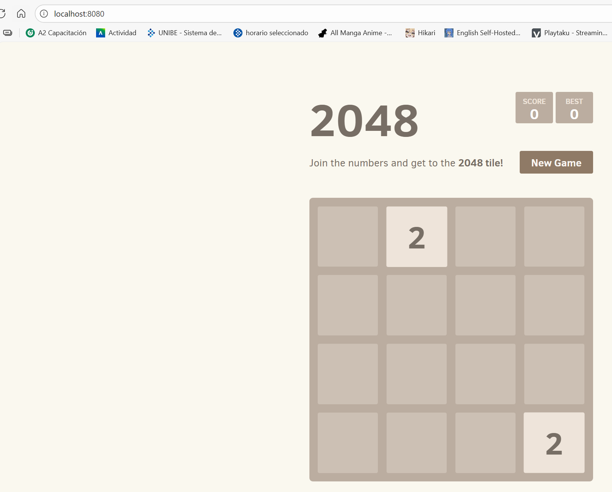

### Verificación en Docker Hub

2. **Imagen en Docker Hub:**
   - URL: `https://hub.docker.com/r/idkman068/nginx-2048`
   - Tags disponibles: `1.0`, `latest`
   - Resultado: ✅ Imagen publicada correctamente

**Evidencia:**
```
[Captura de pantalla de Docker Hub mostrando la imagen y tags]
```
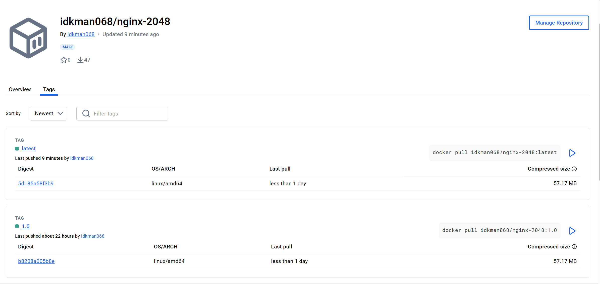

### Verificación en AWS

3. **Acceso desde internet:**
   - Dirección IP pública: `54.163.19.229`
   - URL de acceso: `http://54.163.19.229`
   - Resultado: ✅ Aplicación accesible públicamente

**Evidencia:**
```
[Captura de pantalla accediendo desde el navegador a http://54.163.19.229]
[Captura mostrando la URL con la IP pública en la barra de direcciones]
```
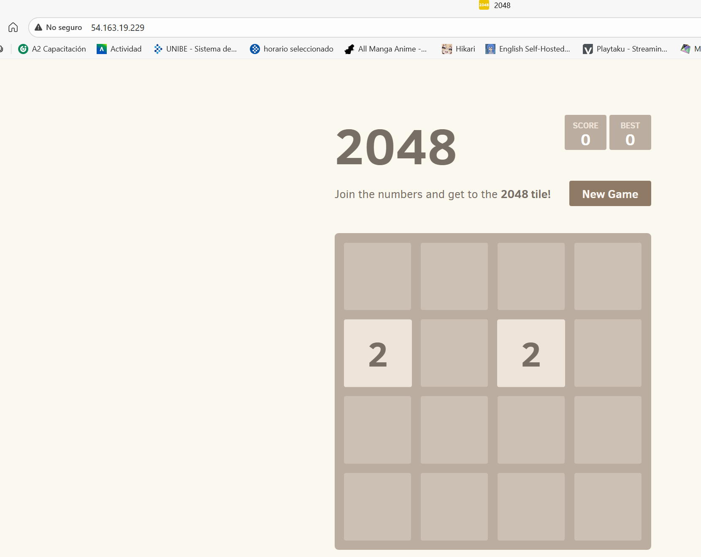

### Pruebas de funcionalidad

4. **Funcionamiento del juego:**
   - Probé los controles (flechas del teclado)
   - Verifiqué que el puntaje se actualiza
   - Probé el botón "New Game"
   - Resultado: ✅ Todas las funcionalidades operan correctamente

5. **Persistencia del contenedor:**
   ```bash
   docker compose restart
   ```
   - El contenedor se reinició correctamente
   - El servicio volvió a estar disponible inmediatamente

**Comandos útiles de verificación:**
```bash
# Ver estado del contenedor
docker ps

# Ver logs en tiempo real
docker logs -f web-2048

# Ver uso de recursos
docker stats web-2048

# Verificar conectividad de red
curl http://localhost:80
```

---

## Conclusiones

### Logros alcanzados

1. ✅ Creación exitosa de un Dockerfile siguiendo las especificaciones
2. ✅ Construcción de imagen Docker funcional con Nginx y aplicación web estática
3. ✅ Publicación correcta de la imagen en Docker Hub con múltiples tags
4. ✅ Configuración de instancia EC2 en AWS con seguridad adecuada
5. ✅ Instalación y configuración de Docker en el servidor EC2
6. ✅ Despliegue exitoso usando Docker Compose
7. ✅ Implementación de CI/CD con GitHub Actions
8. ✅ Aplicación accesible públicamente y completamente funcional

### Aprendizajes clave

- **Containerización**: Comprendí cómo empaquetar una aplicación web con todas sus dependencias en un contenedor Docker portable.
- **Dockerfile**: Aprendí a optimizar las capas del Dockerfile y la importancia del orden de las instrucciones.
- **Docker Hub**: Entendí el flujo de publicación de imágenes y el uso de tags para versionado.
- **Infraestructura cloud**: Configuré recursos en AWS (EC2, Security Groups) para hospedar aplicaciones.
- **Docker Compose**: Simplifiqué el despliegue mediante la definición declarativa de servicios.
- **CI/CD**: Automaticé el proceso de build y publicación con GitHub Actions.

### Dificultades encontradas y soluciones

1. **Problema**: Error al construir la imagen por timeout en git clone
   - **Solución**: Aumenté el tiempo de timeout y verifiqué la conexión a internet

2. **Problema**: Contenedor no accesible desde internet
   - **Solución**: Configuré correctamente el Security Group en AWS para permitir tráfico HTTP (puerto 80)

3. **Problema**: Permisos insuficientes para ejecutar docker
   - **Solución**: Agregué el usuario al grupo docker con `usermod -aG docker ubuntu`

### Posibles mejoras futuras

- Implementar HTTPS con Let's Encrypt y certificados SSL
- Agregar un proxy reverso (Traefik o Nginx Proxy Manager)
- Configurar un dominio personalizado con Route 53
- Implementar healthchecks en el docker-compose.yml
- Agregar monitoreo con Prometheus y Grafana
- Configurar backups automáticos
- Optimizar el tamaño de la imagen usando Alpine Linux
- Implementar multi-stage builds para reducir el tamaño final

---

## Referencias

### Documentación oficial
- [Docker Documentation](https://docs.docker.com/)
- [Dockerfile Reference](https://docs.docker.com/engine/reference/builder/)
- [Docker Compose Documentation](https://docs.docker.com/compose/)
- [Docker Hub](https://hub.docker.com/)
- [GitHub Actions Documentation](https://docs.github.com/es/actions)
- [AWS EC2 Documentation](https://docs.aws.amazon.com/ec2/)

### Guías y tutoriales
- [Guía original de la práctica - José Juan Sánchez](https://josejuansanchez.org/iaw/practica-dockerizar-web/)
- [Introducción a Docker](https://josejuansanchez.org/iaw/practica-docker/)
- [Publishing Docker Images - GitHub Actions](https://docs.github.com/es/actions/publishing-packages/publishing-docker-images)

### Repositorios
- [Juego 2048 original](https://github.com/gabrielecirulli/2048)
- [Mi repositorio del proyecto](https://github.com/[MI_USUARIO]/dockerizar-web-estatica)

---

## Anexos

### Anexo A: Comandos útiles de Docker

```bash
# Construcción de imágenes
docker build -t nombre:tag .
docker images

# Ejecución de contenedores
docker run -d -p 8080:80 nombre:tag
docker ps
docker ps -a
docker logs [container_id]
docker exec -it [container_id] bash

# Gestión de imágenes
docker tag imagen:tag usuario/imagen:tag
docker push usuario/imagen:tag
docker pull usuario/imagen:tag

# Limpieza
docker stop [container_id]
docker rm [container_id]
docker rmi [image_id]
docker system prune -a
```

### Anexo B: Comandos de Docker Compose

```bash
# Iniciar servicios
docker compose up -d

# Detener servicios
docker compose down

# Ver logs
docker compose logs
docker compose logs -f [service_name]

# Reiniciar servicios
docker compose restart

# Ver estado
docker compose ps
```

### Anexo C: Estructura del proyecto

```
dockerizar-web-estatica/
├── .github/
│   └── workflows/
│       └── docker-publish.yml
├── Dockerfile
├── docker-compose.yml
├── README.md
└── INFORME.md
```

---

**Fecha de entrega:** 18 de octubre de 2025  
**Repositorio GitHub:** https://github.com/edwinfang01/dockerizar-web-estatica  
**Imagen Docker Hub:** https://hub.docker.com/r/idkman068/nginx-2048  
**URL aplicación desplegada:** http://54.163.19.229  
**Usuario Docker Hub:** idkman068  
**Instancia EC2:** t2.small en us-east-1 (54.163.19.229)